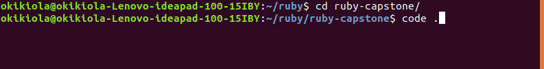
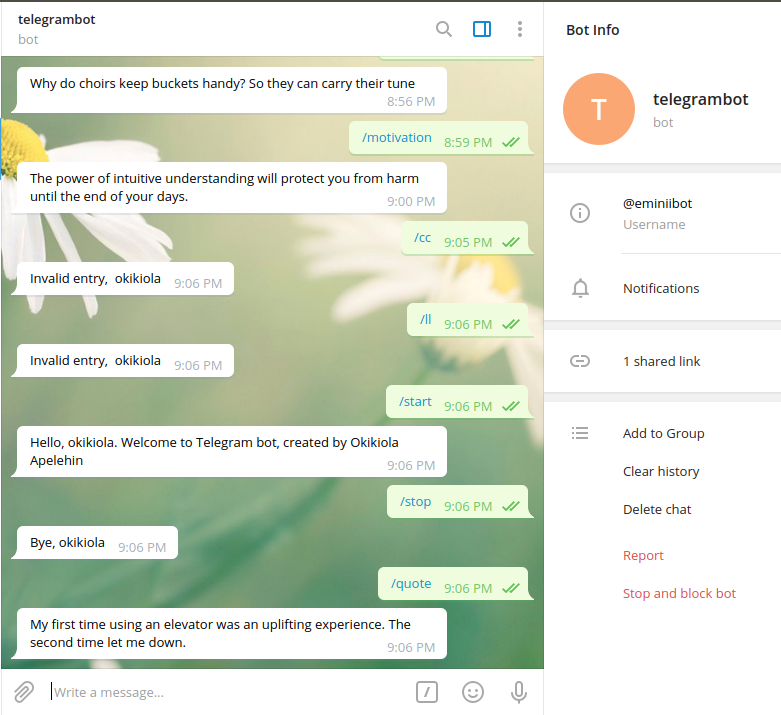

# Ruby capstone
This is a real-world-like project, built with business specifications. This is the implementation of a Telegram bot that send jokes and motivations from differnt API url to the bot using the bot client. 

## Built With

- Ruby
- Telegram bot
- Joke RapidAPI
- Motivation TypeAPI 
- VSCODE

## Getting Started

To get a local copy up and running follow these simple example steps.

### Prerequisites
- Install ruby on linux
- Web browser
- Code editor
- Git and Github
- Telegram Desktop

### Usage

- Install Ruby on your system. Read <a href="https://www.ruby-lang.org/en/documentation/installation/">Ruby documentation</a>
- Clone the project to your local machine (use git clone)
- Open command prompt and run the following command

- In your ruby terminal. Run
run ruby bin/main.rb
- On your Telegram account. Search for
@eminiibot

- Then, type /start command and follow the instructions that comes right after

## Author
- Okikiola Apelehin

- Github: [@okikiola11](https://github.com/okikiola11)
- Twitter: [@Kikiolla3](https://twitter.com/Kikiolla3)
- Linkedin: [@okikiola-apelehin](https://www.linkedin.com/in/okikiola-apelehin-459008122/)

## 🤝 Contributing

Contributions, issues and feature requests are welcome!

Feel free to check the [issues page](https://github.com/okikiola11/ruby-capstone/issues).

## Show your support

Give a ⭐️ if you like this project!

## Acknowledgments

- Google 

## 📝 License

This project is [MIT](lic.url) licensed.